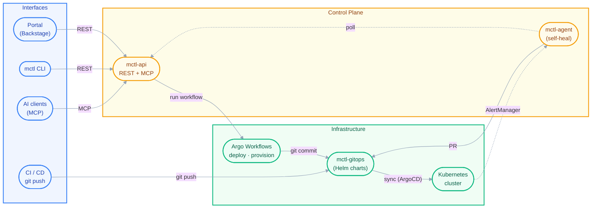

  <h1>MCTL</h1>
  <h3>The AI-Native Kubernetes Platform</h3>
  
Your complete infrastructure stack unified: GitOps, secrets management, team isolation, and AI automation. Deploy services via a portal, REST API, or natural language.

 

  <table>
    <tr>
      <td width="33%" align="center">
          
        <strong>GitOps Engine</strong> 
        Auditable infrastructure changes via ArgoCD and Argo Workflows.
      </td>
      <td width="33%" align="center">
          
        <strong>Secrets Vault</strong> 
        Enterprise-grade security and secret management with HashiCorp Vault.
      </td>
      <td width="33%" align="center">
          
        <strong>Team Isolation</strong> 
        Secure multi-tenancy and RBAC for modern engineering teams.
      </td>
    </tr>
    <tr>
      <td width="33%" align="center">
          
        <strong>Service Catalog</strong> 
        Self-service onboarding and scaffolding via Backstage portal.
      </td>
      <td width="33%" align="center">
          
        <strong>AI Management</strong> 
        Manage infrastructure via REST API or natural language (MCP).
      </td>
      <td width="33%" align="center">
          
        <strong>Automated Provisioning</strong> 
        Automatic PostgreSQL and cloud resource lifecycle management.
      </td>
    </tr>
    <tr>
      <td width="33%" align="center">
          
        <strong>Integrated Monitoring</strong> 
        Full-stack observability with Prometheus, Grafana, and Loki.
      </td>
      <td width="33%" align="center">
          
        <strong>Network Security</strong> 
        Automated TLS, Ingress, and strict zero-trust network policies.
      </td>
      <td width="33%" align="center">
          
        <strong>Cost Control</strong> 
        Optimized for Hetzner Cloud and K3s with efficient resource usage.
      </td>
    </tr>
  </table>

  <table>
    <tr>
      <td width="100%" align="center">
          
        <strong>Autonomous AI Agent</strong> 
        The mctl-agent automatically diagnoses cluster issues via AI and proposes remediation Pull Requests.
      </td>
    </tr>
  </table>

---

## Architecture

---

## Interaction Modes

| Interface | Endpoint | Primary Use Case |
|-----------|----------|------------------|
| **AI / MCP** | `api.mctl.ai/mcp` | Natural language infrastructure management directly from your IDE or AI assistant. |
| **Portal** | `app.mctl.ai` | Visual GUI via Backstage for service catalogs, templated deployment, and tech docs. |
| **CLI** | `mctl deploy` | Traditional terminal-based workflows for fast, scriptable deployments. |
| **REST API** | `api.mctl.ai` | OpenAPI compliant backend for custom automation and integrations. |
| **GitOps** | `git push` | Advanced: Direct cluster delivery for DevOps/Platform engineers. |

---

## The Open-Source Stack

We stand on the shoulders of giants. mctl orchestrates best-in-class open source tools:

* **Infrastructure:** K3s, Terraform, Longhorn, Traefik
* **Delivery:** ArgoCD, Argo Workflows, Helm, GitHub Actions
* **Security:** HashiCorp Vault, External Secrets, cert-manager, Dex (OIDC)
* **Data:** CloudNativePG (PostgreSQL)
* **Observability:** Prometheus, Grafana, AlertManager, Loki
* **Developer Experience:** Backstage

---

## Current Status

mctl is currently in a private beta phase. Access to the repositories, documentation, and the hosted control plane is restricted to invited teams. 

   
  <a href="https://mctl.ai">mctl.ai</a> &nbsp;&bull;&nbsp; <a href="mailto:support@mctl.ai">support@mctl.ai</a>

<!-- SEO Tags: mcp, mcp-server, model-context-protocol, claude-connector, gemini-mcp, kubernetes, k8s, gitops, argocd, platform-engineering, developer-portal, self-healing, ai-agent, mcp.so -->
